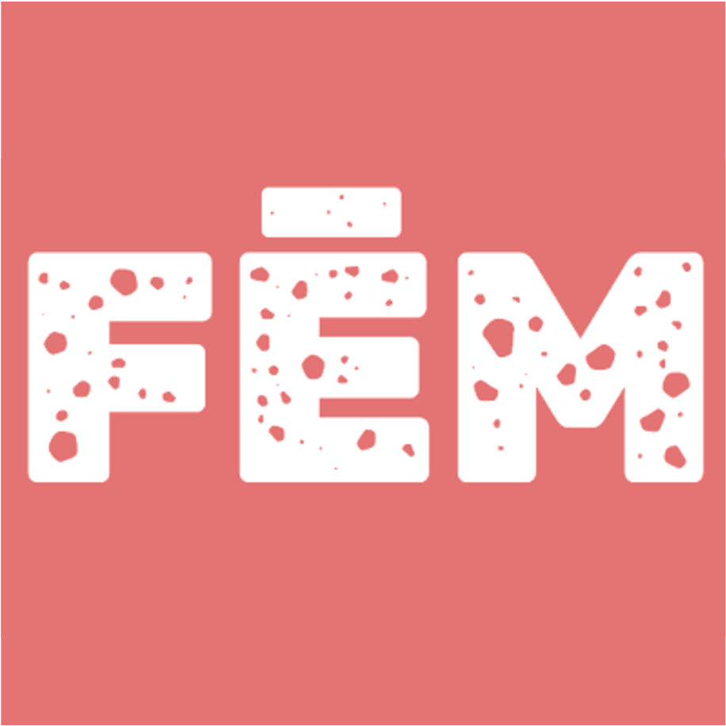

[](https://github.com/fem-readup/fem-readup-search-engine-cms/actions/workflows/crawl-content.yaml)
[](https://github.com/fem-readup/fem-readup-search-engine-cms/actions/workflows/upload-content.yaml)
[](https://github.com/fem-readup/fem-readup-search-engine-cms/issues)

<br />
<p align="center">
  <a href="https://github.com/fem-readup/fem-readup-search-engine-cms">
    
  </a>

  <h1 align="center">Fem Readup Search Engine CMS</h1>

  <p align="center">
    CMS for curated search engine for events
  </p>
</p>

## About The Project

The aim of this app is to provide a queryable list of feminist media and events.

### Built With

* [Python](https://www.python.org/)
* [Hugo](https://gohugo.io/)
* [Firebase](https://firebase.google.com/)

## Installation

Install all packages by running

```
python -m pip install --upgrade pip
pip install firebase-admin
pip install tqdm
pip install requests
pip install urllib3
```

You can start the crawler locally by running

```
python main_crawl --clean
```

## Roadmap

See the [open issues](https://github.com/fem-readup/fem-readup-search-engine-cms/issues).

## License

tbd

## Contact

Florian Schwanz - florian.schwanz@gmail.com
